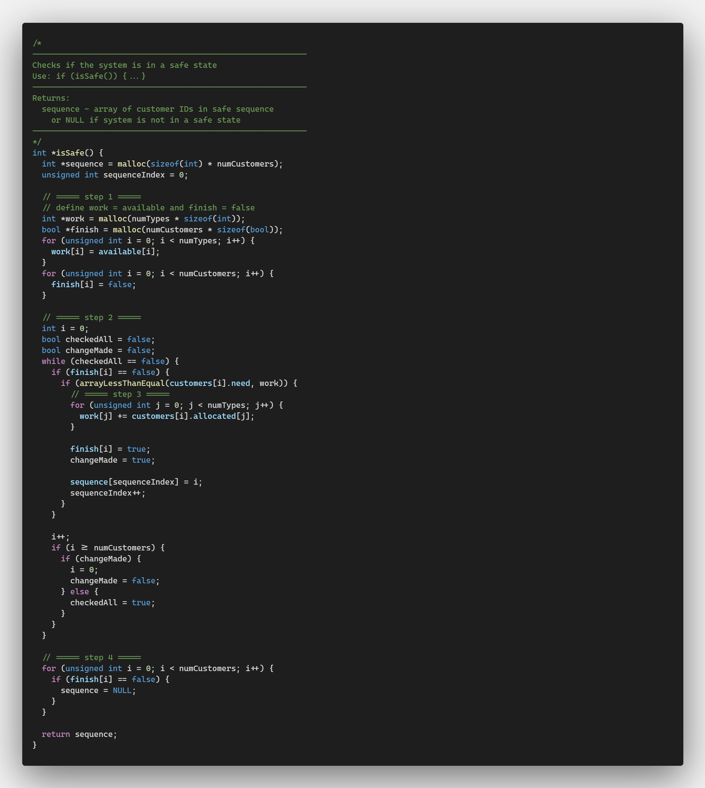
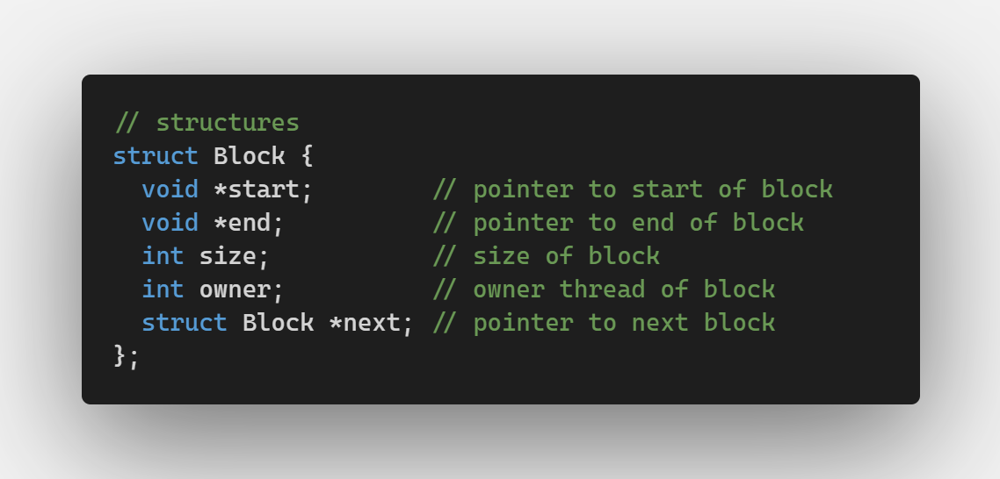

# Bankers Best Fit
These programs seperately apply the bankers algorithm with multi-threading and the best fit algorithm for contiguous memory allocation.

## Usage
Please use the included makefile on a Linux environment to compile and run the programs. If you do not of access to the command `make`, or `gcc`, use `sudo apt install build-essential`.

### Makefile
To compile both progams, simply run `make` in root of the cloned repository.

You can also use `make bankers` or `make bestfit` to compile only one.

Use `make runBankers args="<arguments>"` to run the bankers algorithm program.
Use `make runBestfit args="<arguments>"` to run the bestfit algorithm program.

Optionally use `make clean` to remove object files afterwards.

### License
License can be found [here](/LICENSE).

## Banker's Algorithm
If you would like to see more details, [click here](/bankers-algorithm/README.md).

### Purpose
Prevents deadlocks by implementing a safe function.

### Features
Impliments a safety algorithm to check that the system is in a safe state and yields the safe sequence to run the threads in.


### Example
```bash
Currently Available resources: 10 5 7 8 
Maximum Resources:
6 4 7 3 
4 2 3 2 
2 5 3 3 
6 3 3 2 
5 5 7 5 
Enter Command: RQ 0 1 0 0 1
State is safe, and request is satisfied
Enter Command: RQ 1 1 1 1 1
State is safe, and request is satisfied
Enter Command: RQ 2 2 2 2 2
State is safe, and request is satisfied
Enter Command: RQ 3 1 1 1 1
State is safe, and request is satisfied
Enter Command: RQ 4 1 0 0 0
State is safe, and request is satisfied
Enter Command: Status
Available Resources:
4 1 3 3 
Maximum Resources:
6 4 7 3 
4 2 3 2 
2 5 3 3 
6 3 3 2 
5 5 7 5 
Allocated Resources:
1 0 0 1 
1 1 1 1 
2 2 2 2 
1 1 1 1 
1 0 0 0 
Need Resources:
5 4 7 2 
3 1 2 1 
0 3 1 1 
5 2 2 1 
4 5 7 5 
Enter Command: Run
Safe sequence is: 1 3 2 4 0 
-->     Customer/Thread 1
        Allocated: 1 1 1 1 
        Needed: 3 1 2 1 
        Available: 4 1 3 3 
        Thread has started
                I'm thread 1!
        Thread has finished
Thread 1 is releasing resources

-->     Customer/Thread 3
        Allocated: 1 1 1 1 
        Needed: 5 2 2 1 
        Available: 5 2 4 4 
        Thread has started
                I'm thread 3!
        Thread has finished
Thread 3 is releasing resources

-->     Customer/Thread 2
        Allocated: 2 2 2 2 
        Needed: 0 3 1 1 
        Available: 6 3 5 5 
        Thread has started
                I'm thread 2!
        Thread has finished
Thread 2 is releasing resources

-->     Customer/Thread 4
        Allocated: 1 0 0 0 
        Needed: 4 5 7 5 
        Available: 8 5 7 7 
        Thread has started
                I'm thread 4!
        Thread has finished
Thread 4 is releasing resources

-->     Customer/Thread 0
        Allocated: 1 0 0 1 
        Needed: 5 4 7 2 
        Available: 9 5 7 7 
        Thread has started
                I'm thread 0!
        Thread has finished
Thread 0 is releasing resources
Enter Command: Exit
```

### Contributions
Author: Samson Goodenough
```c
// prototypes
int init_available(int argc, char *args[]);
int init_customers();
void beginListening();
int* isSafe();
void request(struct Customer customer, int *requested);
void release(struct Customer customer, int *released);
void run();
void *customerThread(void *id);

// helper prototypes
bool arrayLessThan(int *array1, int *array2);
bool arrayGreaterThan(int *array1, int *array2);
bool arrayLessThanEqual(int *array1, int *array2);
bool arrayGreaterThanEqual(int *array1, int *array2);
bool arrayAnyGreater(int *array1, int *array2);
int* arrayCopy(int *array, int size);
void printError(char *error);
void printAvailable();
void printCustomer(struct Customer customer);
void printStatus();
void printOpeningStatus();
void printArray(int *array, int size);
```

## Best-Fit Algorithm
### Purpose
Used for contiguous memory allocation.
### Features
Impliments a linked-list style block structure for allocating memory through the best-fit algorithm



### Example
```bash
All Memory Blocks:
        0x5562568612a0 - 0x556256861304, size: 100, owner: NONE
Free: 100
Enter Command: RQ P0 20 B
Successfully allocated 20 to process P0
Enter Command: RQ P1 30 B
Successfully allocated 30 to process P1
Enter Command: RQ P2 5 B
Successfully allocated 5 to process P2
Enter Command: Status
All Memory Blocks:
        0x5562568612a0 - 0x5562568612b3, size: 20, owner: P0
        0x5562568612b4 - 0x5562568612d1, size: 30, owner: P1
        0x5562568612d2 - 0x5562568612d6, size: 5, owner: P2
        0x5562568612d7 - 0x556256861304, size: 45, owner: NONE
Free: 45
Enter Command: RL P2
Successfully released memory for process P2
Enter Command: Status
All Memory Blocks:
        0x5562568612a0 - 0x5562568612b3, size: 20, owner: P0
        0x5562568612b4 - 0x5562568612d1, size: 30, owner: P1
        0x5562568612d2 - 0x556256861304, size: 50, owner: NONE
Free: 50
Enter Command: Exit
```

### Contributions
Author: Samson Goodenough
```c
// method prototypes
void initBlock(struct Block *block, void *start, int size, int owner);
void setBlock(struct Block *block, int size, int owner);
void removeBlock(int ownerId);
void mergeFreeBlocks();
void bestfit(int size, int ownerID);
bool hasBlock(int ownerId);
void beginListening();

// print method prototypes
void printBlocks();
void printError(char *message);
```